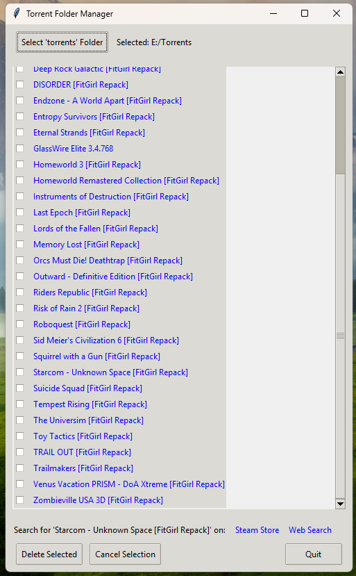

# TorrentScan
Simple program to check your torrent library

This program assumes that you have a folder full of torrent folder where you downloaded your games
Select you folder, it will list the sub folders and you can click the name
You then can select if it needs to search on the steam store or the web
It will search the name of the torrent and open a browser window so you can check what the game was again

If you want to delete that torrent folder, just place a check mark
You can then delete or cancel your actions

Why did i make this : i forget what games are what till my disk runs full, and this is a quick way to check
How did i make this : Gemini 2.5 generated the python program after my prompt for it.

